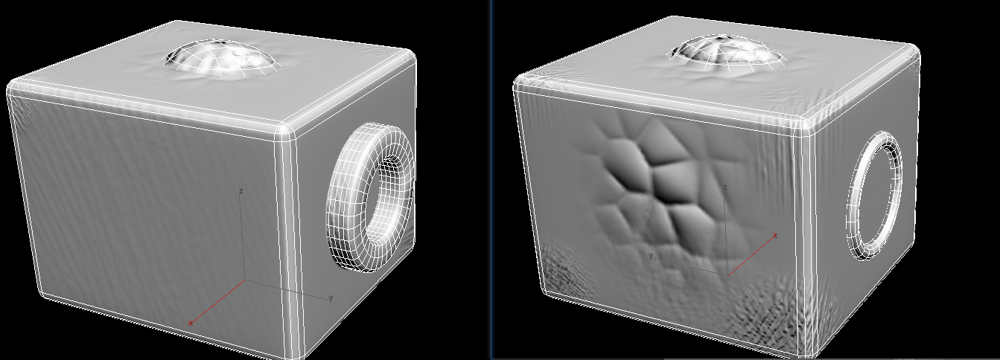
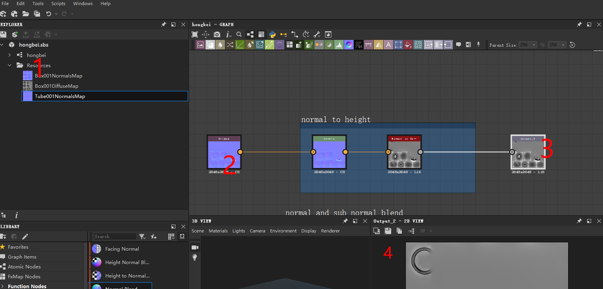
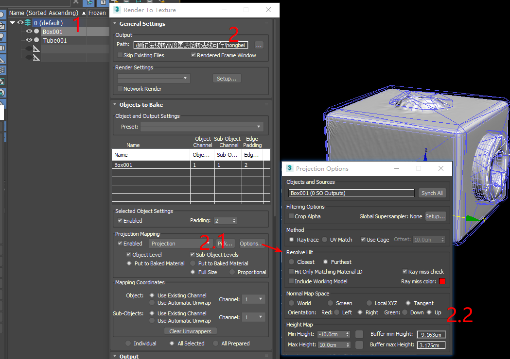
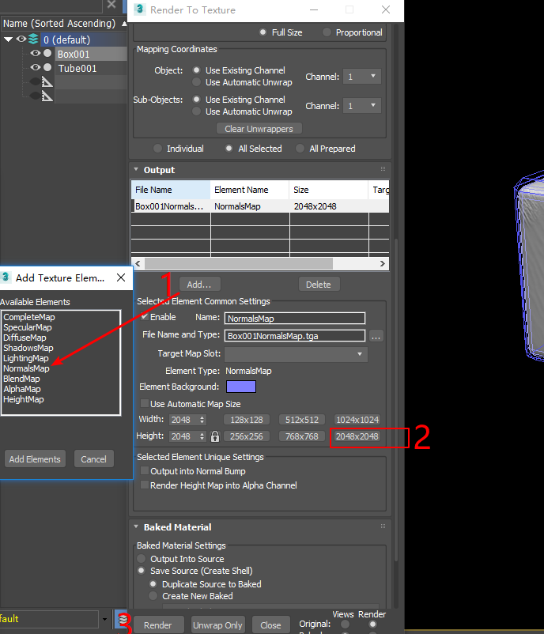
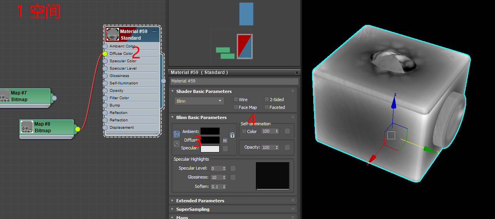
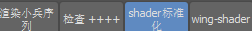
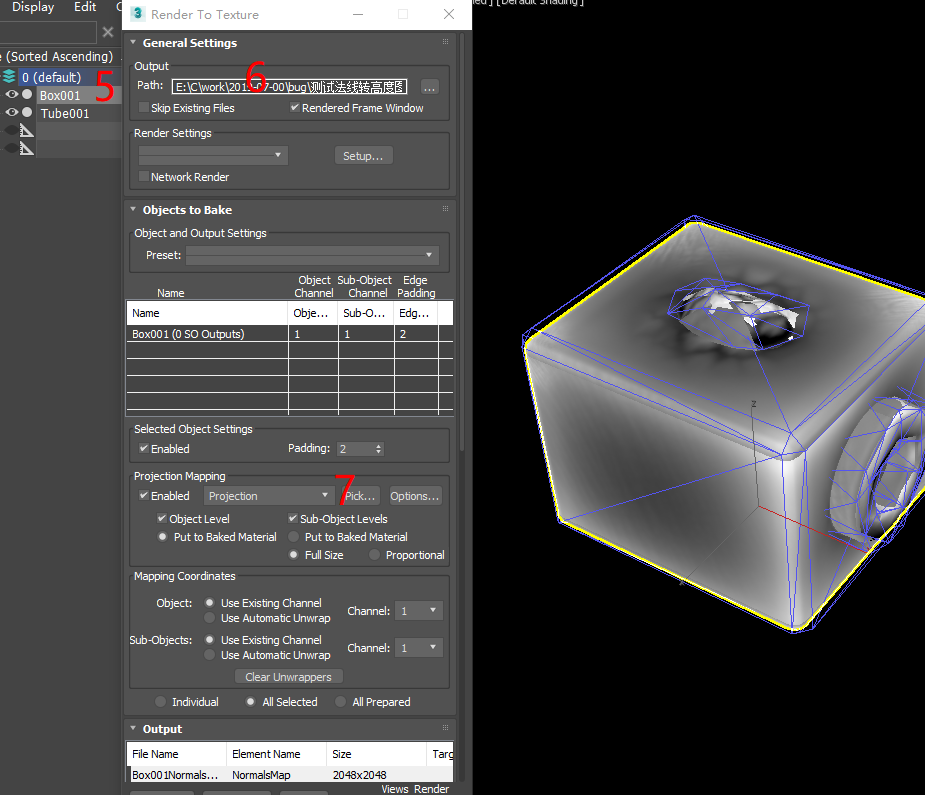
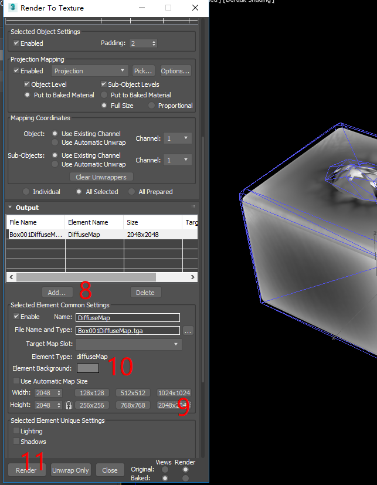
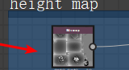
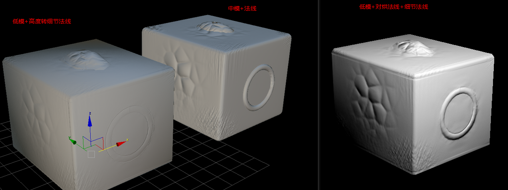

## 法线转高度从新映射在转法线测试    
【说明】: 项目中需要转换一些高面模型 大概1.5-1.9w 模型 带有完整pbr 贴图，需要 映射到 1.5 k 上的地模 上面 ，下面就是处理方法。    
&emsp; 首先制作低模，对于 basecolor mix 贴图采用直接对烘焙来完成 (注意max设置)     
&emsp; 其次处理法线，从1.5k 对烘 1.9w的模型，只能烘焙出来大的结构法线， 对于原来 1.9w上的细节法线，不能直接对烘 (法线是方向信息)   
&emsp; 再次处理细节法线，需要把原模型上1.9w的法线转成高度图，利用 烘焙mix方式对烘焙高度图， 然后在把高度图转法线     
&emsp; 最后 融合 结构法线+细节法线  在加上 basecolor  mix     完成从1.9w 到1.5k 转换 ， 对于lod 通过 simplygon 直接处理     

 对烘焙 basecolor mix heightmap max总是一样的，重点说明  法线转高度图思路验证  
## 具体测试验证    
1. 高面模型+对应的法线效果 (不同角度观察)  
    

2. 法线转灰度图 (利用 substance designer 处理)  直接打开已经设置好的工程   **hongbei.sbs**  工程   
    + 1.贴图直接拖入到工程中
    + 2.在从工程中选择贴图拖入到对应节点上 
    + 3.在输出节点点击在   
    + 4.直接点击保持tga 格式，制作完成 高度图   
       
  
3. basecolor 和mix 烘焙  和后面 高度图烘焙一样，到后面一起说明   
4. 烘焙主结构法线  
         
   + 1.选择低面模型 ，uv 都已经展好
   + 2.这里烘焙贴图路径设置一下，烘焙法线 mix 等贴图放到独立文件中   
   + 2.1这里点  pick 拾取高面模型  
   + 2.2这里是烘焙法线相关的设置，默认max 烘焙是 dx法线模式， 这里 选择    Right ， up   。
   **** 
       
   + 1.加入法线贴图  
   + 2.这里说明一下，这里烘焙法线最好是2048 ，处理完成在利用 ps 二次线性缩放   
   + 3.点击烘焙， 稍等一下，完成法线主结构烘焙     
5. 高度图对烘焙  (basecolor  mix 处理方法和这里相同)     
      
   + 1.首先要把max伽马设置关闭，设置线性空间 (使用ling 工具直接点击)   
   + 2.把高度图给 固有色通道    
   + 3.颜色影响调整 黑色
   + 4.自发光100   
       
   + 5.选择低面模型  
   + 6.同样确定烘焙后存储路径已经设置  
   + 7.pick 高面 （固有色通道贴了图的模型）    
       
   + 8.点击 Add   加入  DiffuseMap 
   + 9.大小采用 2048  
   + 10.这里设置成 灰度128 ，我们需要在 substence designer 中高度图转法线，如果不是中度灰 会有问题 。    
   + 11.点击烘焙    
6. 合并 主结构法线 + 对烘高度图转法线     
   + 0.通道打开之前的 **honebei.sbs** 工程     
      
   + 1.资源拖入到工程  
   + 2.把准备好的 主结构法线 和对烘焙后的高度图 分别拖入 
   + 3.双击打开属性 高度图选择 灰度   
   + 4.选择输出节点，右键   
   + 5.点击保持按钮保持tga格式法线    
   +  到这里高度图烘焙完成    
           

7. basecolor  mix(oa 粗糙度 金属度图) 烘焙和高度图一样   
8. 最后完成 

   
    
 
